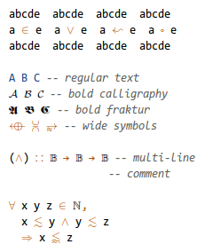
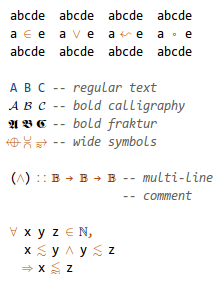

# monospacifier.py

*A great way to increase the Unicode coverage of your favorite programming font.*

`monospacifier.py` adjusts every character of your favorite variable-width font to match a reference monospace font. The result is a good fallback font for characters not covered by the reference: the result is a font setup with good Unicode coverage, without breaking indentation.



## Pre-monospacified fonts (monospace fonts with good Unicode coverage)

Instead of running this program, you can use one of the *pre-generated* monospace fonts listed below (to be use *as a fallback*, for symbols not covered by your favorite font).

### Download a fallback font

Choose from this list (Symbola is a great choice), based on your main programming font:

| Programming font                  | Monospacified fallback fonts                                                                                                                                                                                                                                                                                                                                                                                                                                                                                                                                                                                  |
|:----------------------------------|:--------------------------------------------------------------------------------------------------------------------------------------------------------------------------------------------------------------------------------------------------------------------------------------------------------------------------------------------------------------------------------------------------------------------------------------------------------------------------------------------------------------------------------------------------------------------------------------------------------------|
| **Consolas**                      | [Asana Math](./fonts/Asana_monospacified_for_Consolas.ttf), [FreeSerif](./fonts/FreeSerif_monospacified_for_Consolas.ttf), [Latin Modern Math](./fonts/LatinModernMath_monospacified_for_Consolas.ttf), [STIX Math](./fonts/STIXMath_monospacified_for_Consolas.ttf), [Symbola](./fonts/Symbola_monospacified_for_Consolas.ttf), [TeX Gyre Schola Math](./fonts/TeXGyreScholaMath_monospacified_for_Consolas.ttf), [XITS Math](./fonts/XITSMath_monospacified_for_Consolas.ttf)                                                                                                                               |
| **DejaVu Sans Mono**              | [Asana Math](./fonts/Asana_monospacified_for_DejaVuSansMono.ttf), [FreeSerif](./fonts/FreeSerif_monospacified_for_DejaVuSansMono.ttf), [Latin Modern Math](./fonts/LatinModernMath_monospacified_for_DejaVuSansMono.ttf), [STIX Math](./fonts/STIXMath_monospacified_for_DejaVuSansMono.ttf), [Symbola](./fonts/Symbola_monospacified_for_DejaVuSansMono.ttf), [TeX Gyre Schola Math](./fonts/TeXGyreScholaMath_monospacified_for_DejaVuSansMono.ttf), [XITS Math](./fonts/XITSMath_monospacified_for_DejaVuSansMono.ttf)                                                                                     |
| **Inconsolata LGC for Powerline** | [Asana Math](./fonts/Asana_monospacified_for_InconsolataLGCForPowerline.ttf), [FreeSerif](./fonts/FreeSerif_monospacified_for_InconsolataLGCForPowerline.ttf), [Latin Modern Math](./fonts/LatinModernMath_monospacified_for_InconsolataLGCForPowerline.ttf), [STIX Math](./fonts/STIXMath_monospacified_for_InconsolataLGCForPowerline.ttf), [Symbola](./fonts/Symbola_monospacified_for_InconsolataLGCForPowerline.ttf), [TeX Gyre Schola Math](./fonts/TeXGyreScholaMath_monospacified_for_InconsolataLGCForPowerline.ttf), [XITS Math](./fonts/XITSMath_monospacified_for_InconsolataLGCForPowerline.ttf) |
| **Inconsolata**                   | [Asana Math](./fonts/Asana_monospacified_for_Inconsolata.ttf), [FreeSerif](./fonts/FreeSerif_monospacified_for_Inconsolata.ttf), [Latin Modern Math](./fonts/LatinModernMath_monospacified_for_Inconsolata.ttf), [STIX Math](./fonts/STIXMath_monospacified_for_Inconsolata.ttf), [Symbola](./fonts/Symbola_monospacified_for_Inconsolata.ttf), [TeX Gyre Schola Math](./fonts/TeXGyreScholaMath_monospacified_for_Inconsolata.ttf), [XITS Math](./fonts/XITSMath_monospacified_for_Inconsolata.ttf)                                                                                                          |
| **Terminus (TTF)**                | [Asana Math](./fonts/Asana_monospacified_for_TerminusTTF.ttf), [FreeSerif](./fonts/FreeSerif_monospacified_for_TerminusTTF.ttf), [Latin Modern Math](./fonts/LatinModernMath_monospacified_for_TerminusTTF.ttf), [STIX Math](./fonts/STIXMath_monospacified_for_TerminusTTF.ttf), [Symbola](./fonts/Symbola_monospacified_for_TerminusTTF.ttf), [TeX Gyre Schola Math](./fonts/TeXGyreScholaMath_monospacified_for_TerminusTTF.ttf), [XITS Math](./fonts/XITSMath_monospacified_for_TerminusTTF.ttf)                                                                                                          |

If your favorite combination is not available, please let me know.

### Install it

* On Windows put the font in `C:\Windows\Font`.
* On Debian-inspired systems put the font in `~/.fonts` and run `fc-cache`.

### Configure fallback

#### Emacs

Add the following snippet to your `.emacs` (replacing font names as appropriate), then restart:

``` elisp
(set-fontset-font t 'unicode (font-spec :name "<variable-width font> monospacified for <monospace font>") nil 'append)
```

Here are two examples:

``` elisp
(set-fontset-font t 'unicode (font-spec :name "Symbola monospacified for Consolas") nil 'append)
(set-fontset-font t 'unicode (font-spec :name "Asana Math monospacified for DejaVu Sans Mono") nil 'append)
```

#### Other editors

Please submit recipes for other editors or operating systems!

## Demo

  

Monospace font + default fallbacks — Monospace font + original Symbola — Monospace font + Monospacified Symbola

## Usage

## Details

* For help, run `./monospacifier.py -h`
* For examples of use, see the Makefile (I use it to generate the files listed here)

`monospacifier.py` includes multiple scaling algorithms (only one is exposed on the CLI). They are all rather basic, so don;t expect this program to create anything except a decent fallback font.

The most advanced algorithm (demoed) sets the bounding box of each glyph appropriately (to match the most common width in the monospace font), and slightly compresses wide characters to reduce bleeding (wide glyphs will overlap with neighboring characters), while preserving distinctions between long and short glyphs (so ↦ and ⟼ are still distinguishable). Then (conditional on the `--copy-metrics` flag), `monospacifier.py` adjusts the metrics of the newly created font to match those of the reference (this fixes a number of issues that I don't understand well, in particular with `hhea_descent` and `os2_typodescent` metrics; if you have a clue about this, please do get in touch by opening an issue).
